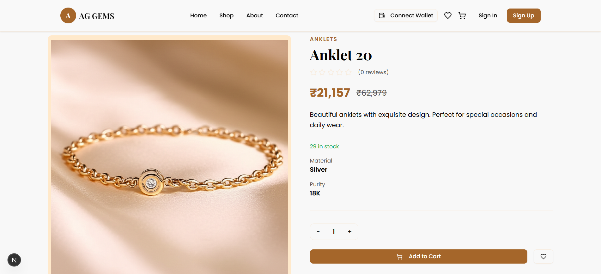

# AG-Gems 💎

AG-Gems is a premium, full-stack luxury jewelry e-commerce platform that blends traditional high-end retail with modern blockchain technology. Built using the **MERN stack** and integrated with **Ethereum**, AG-Gems allows users to browse exquisite gemstones and complete purchases using either traditional payment gateways or cryptocurrency.



## 🚀 Features

* **Premium Shopping Experience**: A highly responsive and elegant UI built with **Next.js 14** and **Tailwind CSS**.
* **Dual Payment Gateway**: 
    * **Traditional**: Integrated with **Razorpay** for UPI, Cards, and Netbanking.
    * **Blockchain**: Real-time **ETH-to-INR** conversion for cryptocurrency payments verified via **Etherscan API**.
* **Web3 Integration**: Secure wallet connection (MetaMask) for decentralized identity and payments.
* **Product Management**: Advanced filtering by category (Gemstones, Rings, Necklaces) and material.
* **Visual Search**: (Optional/Planned) AI-powered search allowing users to upload images to find matching jewelry.
* **Wishlist & Cart**: Persistent shopping cart and wishlist functionality for authenticated users.
* **Admin Dashboard**: Secure management of products, categories, and orders.

## 🛠️ Technical Stack

* **Frontend**: Next.js 14 (App Router), TypeScript, Tailwind CSS, Lucide React.
* **Backend**: Node.js, Express.js.
* **Database**: MongoDB with Mongoose ODM.
* **Blockchain**: Solidity (Smart Contracts), Ethers.js, Etherscan API.
* **Storage**: Cloudinary for high-resolution product imagery.
* **Authentication**: JWT (JSON Web Tokens) with Secure Cookies and CSRF protection.

## ⚙️ Installation & Setup

### 1. Clone the Repository
```bash
git clone [https://github.com/anoop840/ag-gems.git](https://github.com/anoop840/ag-gems.git)
cd ag-gems
